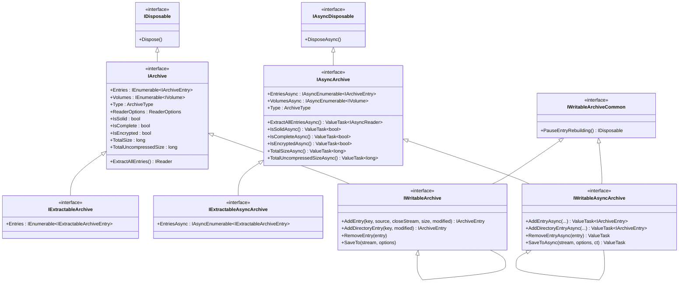
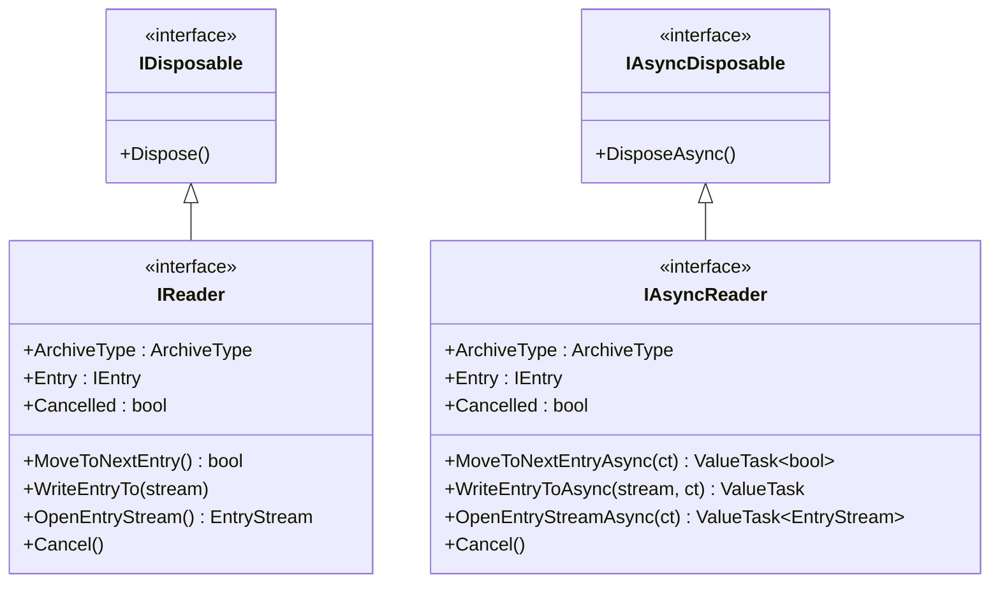
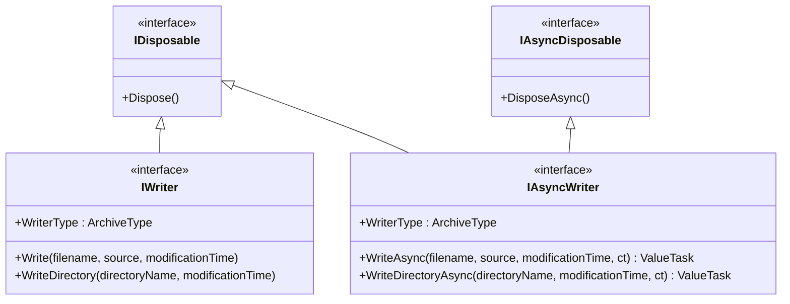
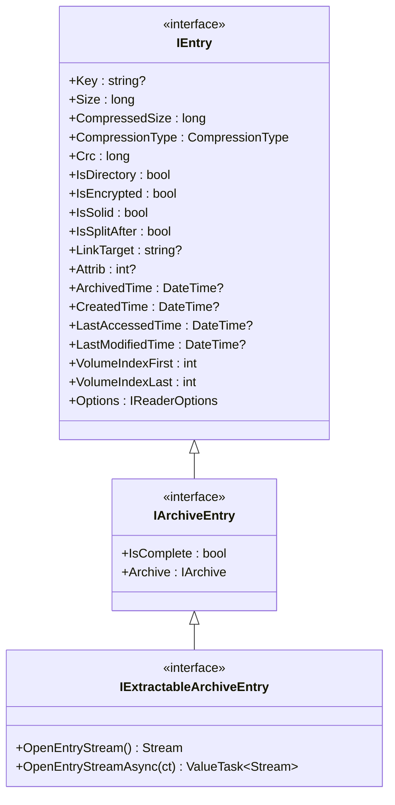
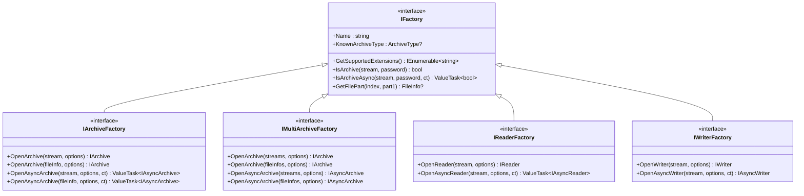
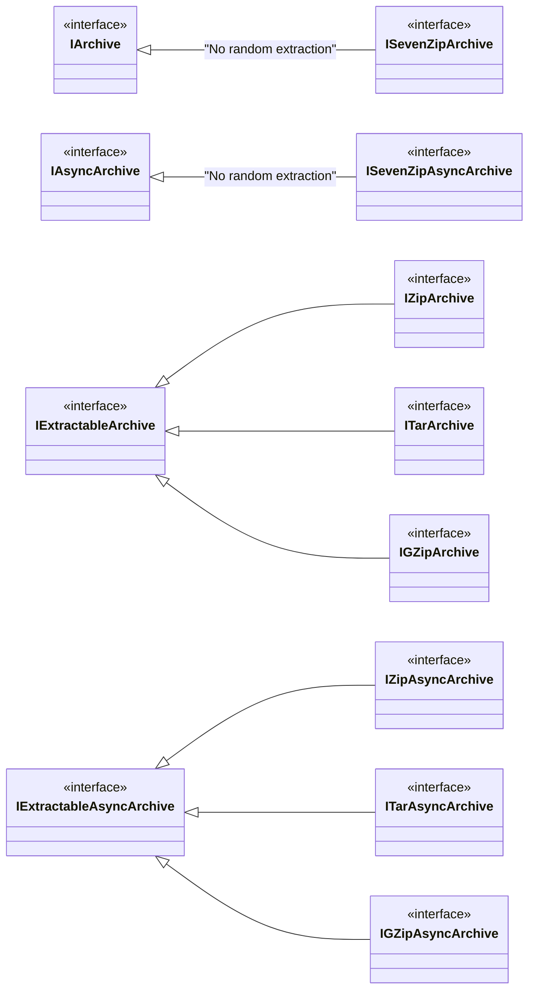
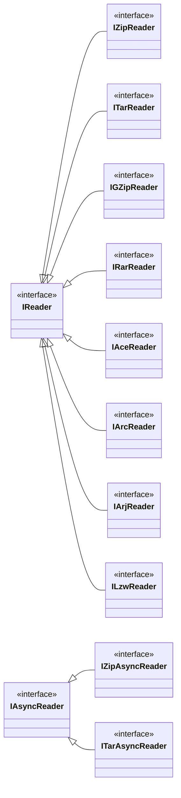
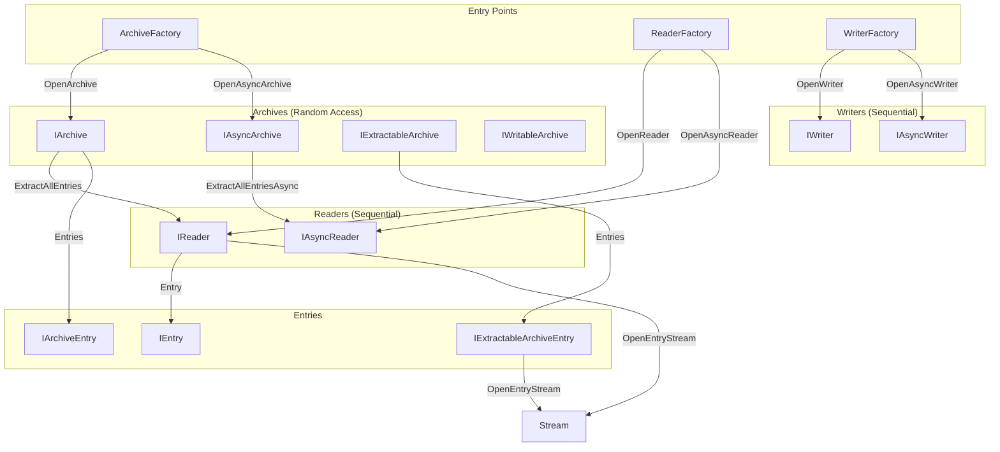

# SharpCompress Interface Architecture

This document describes the interface hierarchy for archives, readers, and writers in SharpCompress.

## Overview

SharpCompress provides three main APIs for working with compressed archives:

| API | Use Case | Stream Requirements | Access Pattern |
|-----|----------|---------------------|----------------|
| **Archive** | Random access to entries | Seekable stream | Load all metadata, extract any entry |
| **Reader** | Sequential streaming | Non-seekable OK | Forward-only, memory efficient |
| **Writer** | Creating archives | Non-seekable OK | Forward-only writes |

---

## Core Interface Hierarchies

### Archive Interfaces



### Reader Interfaces



### Writer Interfaces



---

## Entry Interfaces



---

## Factory Interfaces



---

## Format-Specific Interfaces

Each archive format has marker interfaces that inherit from the core interfaces:

### Archive Formats



> **Note:** 7Zip archives implement `IArchive` directly (not `IExtractableArchive`) because the format requires sequential decompression - you cannot extract individual entries randomly.

### Reader Formats



---

## Relationship Overview



---

## API Selection Guide

### When to use Archive API

- You have a **seekable stream** (file or memory with full access)
- Need **random access** to specific entries
- Want to **list all entries** before extracting
- Need to **modify** the archive (add/remove entries)

```csharp
// Sync
using var archive = ArchiveFactory.OpenArchive(stream);
foreach (var entry in archive.Entries.Where(e => !e.IsDirectory))
{
    entry.OpenEntryStream(); // Random access
}

// Async
await using var archive = await ArchiveFactory.OpenAsyncArchive(stream);
await foreach (var entry in archive.EntriesAsync)
{
    await entry.OpenEntryStreamAsync();
}
```

### When to use Reader API

- Working with **non-seekable streams** (network, pipes)
- Processing **large archives** where memory is a concern
- Only need **sequential forward** access
- Processing entries **as they arrive**

```csharp
// Sync
using var reader = ReaderFactory.OpenReader(stream);
while (reader.MoveToNextEntry())
{
    reader.WriteEntryTo(outputStream);
}

// Async
await using var reader = await ReaderFactory.OpenAsyncReader(stream);
while (await reader.MoveToNextEntryAsync())
{
    await reader.WriteEntryToAsync(outputStream);
}
```

### When to use Writer API

- **Creating** new archives
- **Streaming** content into archives
- Writing to **non-seekable** output streams

```csharp
// Sync
using var writer = WriterFactory.OpenWriter(outputStream, options);
writer.Write("file.txt", contentStream, DateTime.Now);

// Async
await using var writer = WriterFactory.OpenAsyncWriter(outputStream, options);
await writer.WriteAsync("file.txt", contentStream, DateTime.Now);
```

---

## Interface Capabilities by Format

| Format | IArchive | IExtractableArchive | IReader | IWriter |
|--------|----------|---------------------|---------|---------|
| **Zip** | ✅ | ✅ | ✅ | ✅ |
| **Tar** | ✅ | ✅ | ✅ | ✅ |
| **GZip** | ✅ | ✅ | ✅ | ✅ |
| **7Zip** | ✅ | ❌ (sequential only) | ✅ (sequential only) | ❌ |
| **Rar** | ✅ | ✅ | ✅ (read-only) | ❌ |
| **Ace** | ❌ | ❌ | ✅ (read-only) | ❌ |
| **Arc** | ❌ | ❌ | ✅ (read-only) | ❌ |
| **Arj** | ❌ | ❌ | ✅ (read-only) | ❌ |
| **Lzw** | ❌ | ❌ | ✅ (read-only) | ❌ |

---

## Key Design Decisions

1. **Sync/Async Split**: Each major interface has both sync (`IArchive`) and async (`IAsyncArchive`) variants for different use cases.

2. **IExtractableArchive**: Separates archives that support random entry extraction from those that don't (7Zip requires sequential processing).

3. **Marker Interfaces**: Format-specific interfaces (`IZipArchive`, `ITarReader`) are markers that allow type-safe casting when format-specific features are needed.

4. **Factory Pattern**: All instances are created through factories (`ArchiveFactory`, `ReaderFactory`, `WriterFactory`) which handle format detection and instantiation.

5. **Entry Hierarchy**: `IEntry` → `IArchiveEntry` → `IExtractableArchiveEntry` provides progressive capabilities.
